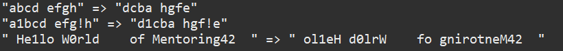

# Anagrams

Simple application that reverses all the words of input text. All non-letter symbols stay on the same places.
Covered with JUnit5 tests (Tests cover Latin alphabet only)

Maven packages application into uber-jar

**Requirements to run this application:**
Java SE 15

**Example of application launch**

